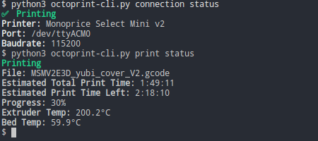

# octoprint-cli


python3 command line tool for controlling OctoPrint servers

This tool uses the OctoPrint API to control and view the status of 3D printers connected to OctoPrint servers

This project is a work in progress. Some features may not work as intended or be missing. If you have suggestions or find bugs, please report them in issues.

## Features

* Connection status
* Print status
* Select file for print
* Pause, resume, cancel prints
* Start print
* System commands (shutdown, reboot, restart)
* Listing files
* Retrieving file/folder information
* Setting extruder and bed temperature
* Connect and disconnect from printer

## Limitations

Currently, octoprint-cli is limited to only printers with a single extruder and bed. Support for additional extruders and chambers may be implemented in the future. This program has been tested on OctoPi 0.17.0 on the Raspberry Pi 4 running OctoPrint 1.4.0 with a Monoprice Select Mini V2

## Usage

```
octoprint-cli
========================================================================================================================
python3 command line tool for controlling OctoPrint servers

COMMANDS
octoprint-cli help                                                           view this help message
octoprint-cli version                                                        view OctoPrint server version
octoprint-cli print status                                                   view print status
octoprint-cli print start                                                    start printing loaded file
octoprint-cli print select [file]                                            load file to be printed
octoprint-cli print pause                                                    pause print
octoprint-cli print resume                                                   resume print if paused
octoprint-cli print cancel                                                   cancel current print
octoprint-cli system shutdown                                                shutdown server
octoprint-cli system reboot                                                  reboot server
octoprint-cli system restart                                                 restart OctoPrint server
octoprint-cli system restart-safe                                            restart OctoPrint server to safe mode
octoprint-cli files list                                                     list files in the root OctoPrint directory
octoprint-cli files list [dir]                                               list files in directory
octoprint-cli files info [file]                                              find information about file or directory
octoprint-cli temp status                                                    find printer temperature information
octoprint-cli temp extruder [temp]                                           set extruder temperature
octoprint-cli temp bed [temp]                                                set bed temperature
octoprint-cli connection status                                              view printer connection status
octoprint-cli connection connect [port /dev/ttyACM0] [baudrate 115200]       connect to printer
octoprint-cli connection disconnect                                          disconnect from printer
```

## Screenshots



## Dependencies

* termcolor
* requests

## Configuration

The tool reads its configuration from either `config.ini` in the script directory or from `~/.config/octoprint-cli.ini`

A sample config file has been included in `sample-config.ini`

```ini
[server]
;Set OctoPrint server address and x-api-key
ServerAddress = SERVER_ADDRESS_HERE
ApiKey = API_KEY_HERE


[printer]
;Set maximum temperature that printer can be set too
MaxExtruderTemp = 250
MaxBedTemp = 85
```

## Todo List

* Upload files
